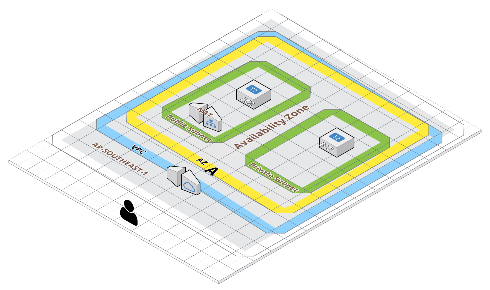

# Exercise 3

## AWS Resources
- VPC
- Subnet
- Route table
- Internet Gateway
- NAT Gateway




## Steps
1. ```terraform init```
2. ```terraform apply```
3. ssh to your public subnet
   1. ```chmod 400 tf_demo.pem```
      - NOTE: New .pem file is create each time.
   2. ```ssh -i tf_demo.pem ubuntu@<ec2_public_ip>```
4. You are now in your public ec2 instance (ubuntu@<ec2_public_ip>). We will now try to ssh into our PRIVATE EC2 connected via our VPC. Only our public ec2 has access via the same vpc.
   1. Open a separate terminal in your local.
   2. Copy your local .pem to your public EC2 instance.
   ```
   scp  -i "tf_demo.pem" tf_demo.pem ubuntu@<EC2 PUBLIC IP>:/home/ubuntu
   ```
   3. Return to your **public** ec2 terminal. 
      1. chmod 400 again 
      2. ssh into your private ec2 instance.
4. ```terraform destroy```
5. See subnet -> route table

## Notes
- Copying file remotely:  
```shell script
scp  -i "tf_demo.pem" <FILE TO COPY> ubuntu@<PUBLIC IP>:/home/ubuntu
```

- A more general VPC diagram would look like as shown below:
