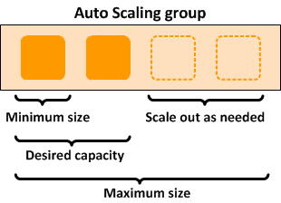

# Exercise 4

## AWS Resources
- IAM Role
- Auto Scaling Group
- Launch Configuration
- ELB
- EC2 with user data

## How Auto scaling group works 
https://docs.aws.amazon.com/autoscaling/ec2/userguide/what-is-amazon-ec2-auto-scaling.html

